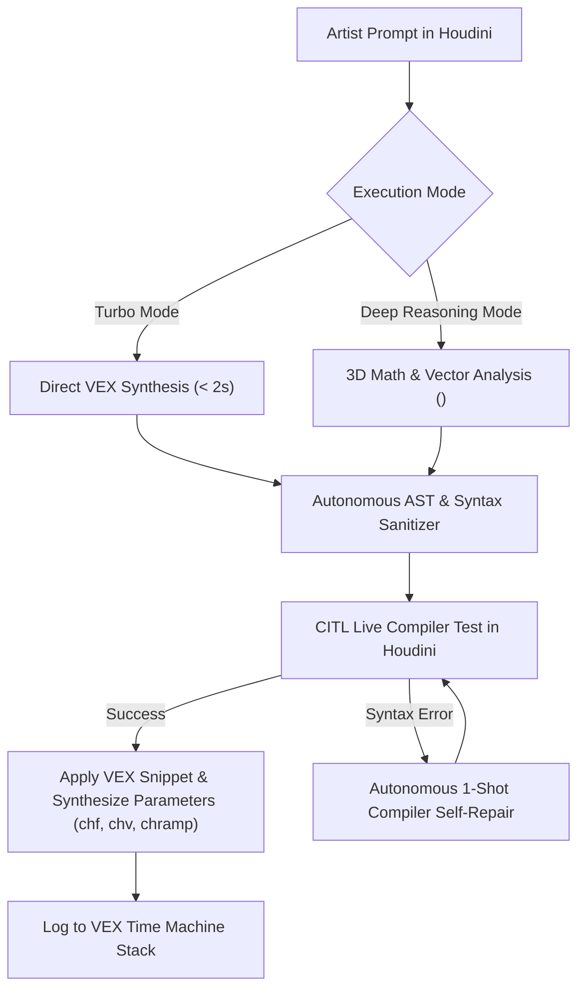

# ⚡ AI Attribute Wrangle: Autonomous AI Copilot for SideFX Houdini

<div align="center">


[](https://huggingface.co/anshulVashist/Qwen3-Houdini-Vex)


**A local-first, zero-cloud AI copilot for procedural geometry and VEX programming inside SideFX Houdini.**

[📥 Download Model Weights (Hugging Face)](https://huggingface.co/anshulVashist/Qwen3-Houdini-Vex) • [🚀 Quickstart](#-quickstart--installation) • [✨ Key Features](#-key-features) • [💡 Examples](#-example-prompts--generated-vex)

</div>

---

## 📖 Overview

**AI Attribute Wrangle** is a custom Houdini SOP digital asset (`ai_attribwrangle.hda`) powered by a domain-specialized neural model (**Qwen3-Houdini-VEX**). It enables procedural artists and Technical Directors (TDs) to generate, refine, explain, and optimize complex Houdini VEX code using plain English instructions.

Unlike generic cloud LLMs that hallucinate C++ / Python syntax or emit incompatible code, **AI Attribute Wrangle** operates with:
- **100% Offline Inference**: All reasoning runs on your local GPU/CPU. Zero data leaves your workstation.
- **Autonomous Compiler-in-the-Loop (CITL) Self-Healing**: Automatically catches compiler syntax warnings and repairs them on-the-fly.
- **Dynamic Parameter Synthesis**: Automatically builds interactive UI sliders (`chf`, `chv`, `chramp`, `chi`) on the node.
- **VEX Time Machine**: Non-destructively navigate forward and backward through your prompt history.

---

## ✨ Key Features



### 1. 🧠 Deep Reasoning Mode (`<think>`)
Solves complex 3D procedural problems involving:
- 3D Transformation matrices & intrinsic transforms
- Quaternion rotations (`qmultiply`, `quaternion`, angle-axis)
- Curl noise vector fields, Voronoi metrics, and geodesic falloffs
- Point, Primitive, Detail, and Vertex wrangle contexts

### 2. 🪄 Autonomous CITL Self-Repair Loop
If code compilation fails, the system automatically captures Houdini's live compiler error stream, performs a self-healing diagnostic pass, and applies the corrected snippet before you even notice.

### 3. 🎛️ Dynamic Parameter Synthesis
Whenever the AI references `chf("scale")`, `chv("direction")`, or `chramp("falloff", dist)`, the node dynamically creates the corresponding float sliders, vector fields, and spline ramps in the Houdini parameter interface.

### 4. ⏳ VEX Time Machine
Non-destructively step backward (`◀ Prev Version`) and forward (`▶ Next Version`) through previous VEX iterations with timestamps and cook benchmark times.

### 5. 💡 Explain & Document
One click annotates any existing messy VEX code with clean, educational inline comments and vector math docstrings without altering functional logic.

---

## 🚀 Quickstart & Installation

### Option 1: Native 1-Click GUI Setup (Recommended)
1. Clone or download this repository.
2. Download the model weights [`qwen3-vex.gguf`](https://huggingface.co/anshulVashist/Qwen3-Houdini-Vex/blob/main/qwen3-vex.gguf) (**8.71 GB**) from Hugging Face and place it in the `models/` folder.
3. Double-click **`Setup_AI_Wrangle.exe`** (or run `python installer_gui.py`).
4. Select your Houdini version(s) and click **"🚀 1-Click Install"**.
5. Restart Houdini.

### Option 2: 1-Click Drag-and-Drop (Inside Houdini, Zero Restart)
1. Open SideFX Houdini.
2. Drag and drop **`install_in_houdini.py`** into your Houdini viewport or Python Shell (or select `File -> Run Script`).
3. The node is installed and loaded live into your active session immediately!

---

## 🎯 How to Use in Houdini

1. In any Geometry Network (`/obj/geo`), press **TAB** and add an **`AI Attribute Wrangle`** (or `ai_attribwrangle`) node.
2. In the **AI Prompt** field, describe what you want in natural language:
   > *"Create a spiral vortex pulling points inward with curl noise turbulence and velocity-aligned normals."*
3. Click **🪄 Generate VEX**!
4. The generated VEX code compiles immediately, and any parameters (`chf`, `chv`, `chramp`) appear interactively on the node.

---

## 💡 Example Prompts & Generated VEX

### Prompt:
> *"Create an audio-reactive ripple wave displacing points outward with dampening falloff and normal recalculation."*

### Generated VEX:
```c
// Calculate planar distance from origin
vector pos = @P;
float dist = length(set(pos.x, 0, pos.z));

// Dynamic Parameters
float freq = chf("wave_frequency");
float speed = chf("wave_speed");
float amp = chf("wave_amplitude");
float decay = chf("damping_decay");

// Compute concentric wave with exponential damping
float wave = sin(dist * freq - @Time * speed) * exp(-dist * decay);
@P.y += wave * amp;

// Analytical normal recalculation for smooth shading
float d_wave = (freq * cos(dist * freq - @Time * speed) - decay * sin(dist * freq - @Time * speed)) * exp(-dist * decay) * amp;
vector grad = normalize(set(pos.x, 0, pos.z)) * d_wave;
vector tangent_x = set(1.0, grad.x, 0.0);
vector tangent_z = set(0.0, grad.z, 1.0);
@N = normalize(cross(tangent_z, tangent_x));

// Color ramp visualization
@Cd = chramp("wave_color", fit(wave, -1.0, 1.0, 0.0, 1.0));
```

---

## 📂 Repository Structure

```
Houdini-Ai-Attribute-Wrangle/
├── 📂 otls/
│   └── 📄 ai_attribwrangle.hda        <- SideFX Houdini SOP Digital Asset
├── 📂 python/
│   ├── 📄 houdini_ai_wrangle.py       <- Core SOP Controller, CITL loop, & parameter sync
│   ├── 📄 vex_rag_engine.py           <- Domain RAG context & VEX function database
│   ├── 📄 engine_manager.py           <- Embedded engine lifecycle & dynamic VRAM allocator
│   ├── 📄 license_validator.py        <- Validation & hardware fingerprint engine
│   └── 📄 model_vault.py              <- Model loading & decryption utilities
├── 🚀 Setup_AI_Wrangle.exe            <- Native Win32 GUI Setup Wizard
├── 📄 installer_gui.py                <- Standalone Tkinter Setup Wizard
├── 📄 install_in_houdini.py           <- In-Houdini 1-Click Drag & Drop Installer
├── 📄 Setup_Launcher.cpp              <- Native GUI Bootstrap Launcher Source
├── 📂 commercial_build/
│   ├── 📄 package_builder.py          <- Automated Cython compiler & release bundler
│   ├── 📄 verify_release.py           <- Release integrity & contract verification
│   └── 📄 installer.iss               <- Inno Setup Windows installer configuration
├── 📂 release/                        <- EULA, Third-Party Notices, & Documentation
├── 📄 .gitignore
├── 📄 LICENSE                         <- Apache 2.0 License
└── 📄 README.md
```

---

## 🔗 Model Weights & Downloads

* **Hugging Face Model Hub**: [https://huggingface.co/anshulVashist/Qwen3-Houdini-Vex](https://huggingface.co/anshulVashist/Qwen3-Houdini-Vex)
* **Direct GGUF Download (8.71 GB)**: [Download `qwen3-vex.gguf`](https://huggingface.co/anshulVashist/Qwen3-Houdini-Vex/resolve/main/qwen3-vex.gguf)

---

## 📜 License

This project is licensed under the **Apache License 2.0** - see the [LICENSE](LICENSE) file for details.

Developed with ❤️ for the Houdini & VFX community by **Anshul Vashist**.
